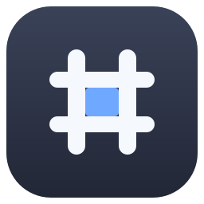

<p align="center">
  
</p>

# Pound

[](LICENSE)


**Repo:** [github.com/butageek/pound](https://github.com/butageek/pound) · Issues and PRs welcome.

**Pound** is a lightweight **file viewer for Windows** written in Rust. It
starts with markdown — rendered out of the box, with the raw source one
toggle away — and is growing into more file types (CSV) and editing.

> Working MVP: Windows 10/11. Development happens on Linux/WSL; see
> [AGENTS.md](AGENTS.md) for the environment, build and release playbook
> (written for humans *and* AI coding agents).

## Install (Windows, no admin rights)

Open PowerShell and paste:

```powershell
powershell -c "irm https://raw.githubusercontent.com/butageek/pound/main/tools/install.ps1 | iex"
```

This downloads the latest release build from GitHub, copies it to
`%LOCALAPPDATA%\Pound`, adds a Start Menu shortcut and your user `PATH`,
and registers Pound with Windows so `.md` files can open with it. Then
right-click any `.md` file → **Open with** → **Pound** (tick *Always*).

**Upgrades use the exact same command** — it detects an existing install,
closes a running Pound (gracefully, then forcefully), replaces the exe,
re-registers, and prints the new version.

To make Pound the default `.md` handler in the same step:

```powershell
irm https://raw.githubusercontent.com/butageek/pound/main/tools/install.ps1 -OutFile install.ps1
powershell -ExecutionPolicy Bypass -File .\install.ps1 -SetDefault
```

Prefer a manual install from the [releases page](https://github.com/butageek/pound/releases)?
Grab `pound-<version>-win64.zip` and follow the bundled `QUICK-START.txt`.

Uninstall:

```powershell
powershell -c "irm https://raw.githubusercontent.com/butageek/pound/main/tools/uninstall.ps1 | iex"
```

## Features

- **Browser-grade rendering**: the markdown pane is an embedded WebView2
  — the same class of engine VSCode's preview uses — with a GitHub-style
  stylesheet and native Segoe UI / Consolas typography. Light & dark
  themes follow the system.
- Opens `.md` / `.markdown` files from double-click, drag-and-drop, or the
  command line (`pound file.md`).
- **Rendered view by default**, with a **Source toggle** that opens a
  side-by-side panel showing the raw markdown. Shortcut: `Ctrl+U`.
- **Synced scrolling** — in split view, scrolling either pane scrolls the
  other to the matching position (VSCode-style).
- **Live editing** — the source pane is an editor: typing updates the
  rendered preview instantly (debounced), `Ctrl+S` or the **Save** button
  writes the file back to disk. The title bar and status bar mark
  unsaved edits, and edits are never clobbered by on-disk changes.
- **Status bar**: full path of the open file plus its type, character and
  line counts.
- Full CommonMark via pulldown-cmark: tables, task lists, strikethrough,
  inline HTML (sanitized), local images (served via a custom `poundimg://`
  protocol), links open in your browser, code blocks have copy buttons.
- Auto-reloads when the file changes on disk — keeping your reading
  position.
- **Self-updates** — checks GitHub on start and offers **Update &
  restart**, which runs the official installer in place (replaces the exe,
  keeps your registration) and relaunches. The status bar always shows
  the running version.
- Installs per-user — **no admin rights required**.
- Registers in the Windows app list (`RegisteredApplications` + ProgId) so
  other apps and the "Open with" / "Default apps" dialogs can find it.

## Architecture — MVP (Model–View–Presenter)

| Layer | File | Responsibility |
|---|---|---|
| Model | `src/model.rs` | App state: open document (source + rendered HTML), source toggle, errors, reload revision. No UI types. |
| Rendering input | `src/markdown.rs` | pulldown-cmark → HTML; rewrites local images to `poundimg://`; sanitizes with ammonia. Unit-tested headlessly. |
| Presenter | `src/presenter.rs` | User intents: open/toggle, drag-and-drop routing, link opening. Owns the Model. |
| View | `src/view.rs` | WebView2 shell (tao + wry): top bar, rendered pane, source pane, status bar. Displays the model, forwards intents. |
| Windows glue | `src/register.rs` | Registry integration (`register` / `unregister` subcommands). |

```
 double-click .md ─┐
 drag & drop ──────┤        ┌─────────────────┐  intents   ┌────────────┐ state ┌───────┐
 CLI argument ─────┼─────► │  View           │ ─────────► │ Presenter  │ ────► │ Model │
 Ctrl+U toggle ────┘       │  (WebView2/wry) │ ◄───────── │            │ ◄───  │       │
                            └─────────────────┘  HTML push └────────────┘       └───────┘
```

Rendering happens in a real browser engine (WebView2) — the same
approach that gives VSCode's preview its quality — markdown is turned
into HTML+CSS instead of being hand-laid-out by the GUI toolkit.

## Using it

- Double-click a `.md` file (once Pound is the handler), or run
  `pound file.md`, or drag a file onto the window.
- The document renders immediately.
- Click **Source** (top right) or press `Ctrl+U` to toggle the side-by-side
  raw markdown panel. In split view, scrolling either pane scrolls the
  other to the matching position.
- Edit the markdown in the source pane — the preview updates as you type;
  press `Ctrl+S` (or click **Save**) to write the file. `Tab` indents.
- Code blocks have a **Copy** button; links open in your default browser.
- Saving the file in another editor updates the view automatically.

## Windows registration details

`pound register [--default]` writes **HKCU-only** keys (no admin):

- `HKCU\Software\Classes\Pound.md` — a ProgId with `shell\open\command`
  `"pound.exe" "%1"`, so the app appears in *Open with* / *Default apps*.
- `.md\OpenWithProgids` + `Explorer\FileExts\.md\OpenWithProgids` entries.
- `HKCU\Software\RegisteredApplications` + `Software\Pound\Capabilities`
  (name, description, `.md` FileAssociation) — this is what puts Pound in
  the **system app list** other apps enumerate.
- With `--default`, it also sets the per-user `.md` class default and
  notifies the shell (`SHChangeNotify`).

> **Note on defaults:** modern Windows protects Explorer's per-file
> `UserChoice` with a hash, so no third-party app can silently become the
> double-click default. After `--default`, most launch paths work
> immediately; if Explorer still shows the "How do you want to open this
> file?" dialog, pick Pound once with *Always*, or confirm via
> `start ms-settings:defaultapps`. This is a platform restriction, not a
> bug in Pound.

## Development

Requirements: rustup stable. Non-Windows hosts run the unit tests only;
building the GUI (and release zips) needs a Windows machine or CI with the
MSVC toolchain (`x86_64-pc-windows-msvc`).

```bash
cargo test                                         # unit tests (headless)
cargo fmt --all && cargo clippy --all-targets      # keep CI green
cargo check --target x86_64-pc-windows-msvc        # type-check Windows code from any OS
./scripts/package.sh                               # build dist/pound-<ver>-win64.zip (MSVC host)
python3 tools/gen_icon.py                          # regenerate the logo & icon set (stdlib only)
```

On a Windows machine you can also build and install natively:

```powershell
git clone https://github.com/butageek/pound && cd pound
cargo build --release
powershell -ExecutionPolicy Bypass -File tools\install.ps1 -BinaryPath .\target\release\pound.exe -SetDefault
```

### CI & releases

Everyday pushes to `main` are preservation-only (no CI), matching this
repo family's convention. Pull requests and manual dispatch run
[CI](.github/workflows/ci.yml) (fmt, clippy, tests, Windows cross-check).
Pushing a version tag runs [Release](.github/workflows/release.yml):

```bash
# bump version in Cargo.toml, commit, then:
git tag v0.X.Y && git push origin main --tags
```

It builds `pound.exe` on a `windows-latest` MSVC runner (statically
linked CRT and WebView2Loader — an import-table check refuses to ship any
exe depending on non-system DLLs), packages the release zip (with
`QUICK-START.txt` + `LICENSE`) and publishes a GitHub Release with notes
generated from the commits since the previous tag — which is exactly what
the install one-liner downloads.

## Logo & icons

The mark is the pound sign — the project's namesake — drawn as a
four-color grid: one app, many kinds of content. Everything is generated
by `tools/gen_icon.py` (stdlib only, deterministic):

- `assets/pound.ico` — multi-size Windows application icon (16–256)
- `assets/pound.png` — window icon used at runtime
- `assets/logo/pound-icon.svg` + PNGs (512/256/128/64/32) — for reuse in
  other applications and docs
- `assets/logo/pound-mark.svg` — transparent mark; strokes use
  `currentColor`, so it adapts to the host page's text color

## Roadmap

Pound starts as a markdown reader and grows into a lightweight viewer and
editor for more file types.

- [ ] More file types: CSV/TSV tables first, then plain text and beyond
- [ ] Syntax highlighting for the source pane
- [ ] Table of contents sidebar; footnotes; remote images
- [ ] winget manifest once the release has some real-world use

## License

MIT — see [LICENSE](LICENSE).
